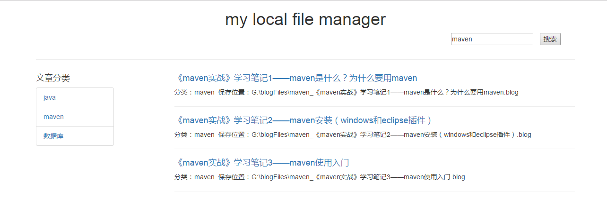

## 项目描述
这是一个很简单的类博客系统，旨在方便管理本地笔记文档，整体采用spring+springmvc+angularjs+bootstrap+markdown实现，主要包括分类、查看、搜索等功能。

## 项目背景
由于记忆有限，学的东西难免忘记，因此就需要一定的笔记来帮助记忆。 
之前基本都是在CSDN用博客，或者有道云笔记，或者直接本地文件系统的文档来充当笔记。 
这些方式都有他们的优势所在，但是在实际使用时，他们又都有不是那么顺手的地方，比如：csdn和有道云笔记都必须联网才能使用，这使得在没有网络的情况下就显得鸡肋；而本地文件系统虽然可以不联网，但在查看、分类的直观性上却又不如博客网站和有道云笔记。 
因此，我就希望有那么一个系统，可以既能像博客网站那样直观的分门别类和搜索，又能使我在不联网的情况下也能方便的查看。 
在这种需求前提下，便找到了hexo博客系统，可以很方便的管理本地博客，于是我用了一段时间。 
然而，当博客多了以后我又发现，里边的搜索功能有些鸡肋，需要连接谷歌才能搜索，这就使得搜索成了摆设，于是我便想到自己弄一个简单的本地文件管理系统，类似hexo，却又不完全相同。 
目的就是方便的查看本地笔记文件，大概界面如下：

## 环境说明
1. maven
1. tomcat7
1. jdk8
1. spring4.3.9
1. angularjs1.6.9
1. jquery3.2.1
1. bootstrap3.3.7
1. markdown

## 已实现功能
1. 数据持久化采用文件系统（文本文档）
1. 基本框架和前台简单界面
1. 实现根据后台类型集合动态显示分类
1. 实现点击具体分类查询出该类下笔记
1. 实现点击笔记列表标题，展示具体笔记内容
1. 实现分类查询列表和笔记详情页的自由切换
1. 实现搜索功能
1. 实现前台展示页码功能

## 使用说明
1. config.properties文件中指定笔记文件存放根目录以及每页显示笔记的条数
1. 文本笔记的文件名格式：type_文章标题.自定义后缀，例如"java_面向对象的理解.blog"
1. 笔记内容中的标题可使用"## "开头，显示的时候将会在上边加一条横线隔开
1. 可以在搜索框输入关键字，点击搜索按钮进行搜索